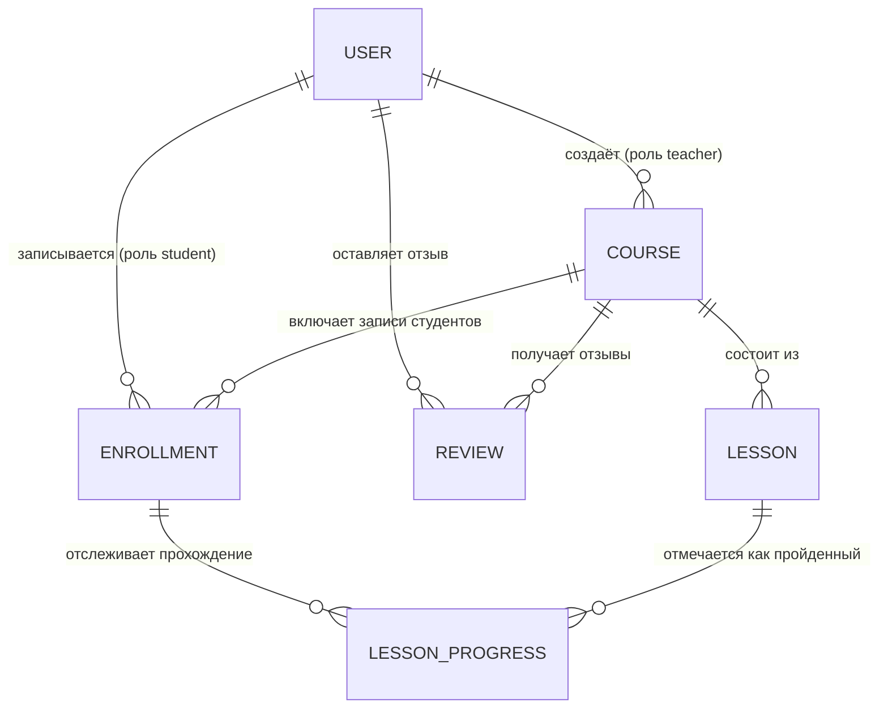
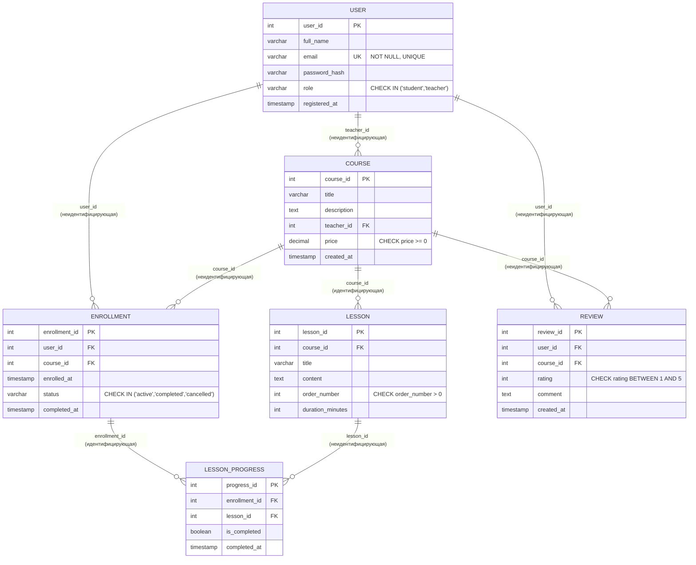

# Домашнее задание №1. От бизнес-требований к физической модели

**Вариант №1. Онлайн-курсы (EdTech)**

Автор: _впишите своё имя_
Репозиторий: https://github.com/Applsin/databases_2026

---

## 0. Бизнес-домен (напоминание условия)

Платформа онлайн-образования. Пользователи регистрируются, выбирают курсы и учатся.
Курс состоит из уроков. Преподаватели создают курсы и получают отчисления от продаж.
Студенты пишут отзывы и ставят оценку курсу от 1 до 5.

Ключевые бизнес-требования, которые определили модель:

1. Пользователь может быть и студентом, и преподавателем → нужен единый справочник
   пользователей с ролью, а не два разных "человека".
2. У курса ровно один автор-преподаватель, но у преподавателя может быть много курсов
   → связь «один ко многим» `User → Course`.
3. Студент может учиться на нескольких курсах, курс может иметь много студентов →
   связь «многие ко многим», реализуемая через ассоциативную сущность `Enrollment`
   (в ней же удобно хранить прогресс и статус прохождения курса — п.6).
4. Курс состоит из нескольких уроков, у урока есть порядок показа → `Lesson` с полем
   `order_number` и обязательной привязкой к курсу (без курса урок не существует —
   идентифицирующая связь).
5. Отзыв пишет конкретный студент на конкретный курс, оценка ограничена диапазоном
   1–5 → `CHECK (rating BETWEEN 1 AND 5)`, и логично запретить два отзыва одного
   студента на один и тот же курс → `UNIQUE (user_id, course_id)`.
6. Нужно хранить статус завершения урока/курса (доп. рекомендация задания) →
   добавлена сущность `LessonProgress`, привязанная к конкретной записи на курс
   (`Enrollment`) и к уроку; на её основе можно посчитать «курс пройден» как
   агрегат (все уроки завершены).
7. Отчисления преподавателю считаются по деньгам за прошедшие оплаты, поэтому у
   `Course` есть `price`, а у `Enrollment` — `enrolled_at`, что позволяет считать
   выручку преподавателя за период.

---

## 1. Концептуальная модель (без атрибутов)

Сущности (6, минимум по заданию — 5): **User, Course, Lesson, Enrollment, Review,
LessonProgress**.



**Пояснение по связям (текстом, т.к. на концептуальном уровне атрибутов ещё нет):**

- `User–Course` — один пользователь-преподаватель может создать много курсов;
  курс принадлежит ровно одному преподавателю.
- `User–Enrollment–Course` — реализация связи «многие ко многим» между студентами
  и курсами через ассоциативную сущность.
- `Course–Lesson` — курс содержит множество уроков; урок без курса не существует.
- `User–Review–Course` — студент оставляет отзывы на курсы, на которые записан.
- `Enrollment–LessonProgress–Lesson` — прогресс конкретного студента по
  конкретному уроку в рамках конкретной записи на курс.

---

## 2. Логическая модель (с атрибутами, ключами и кардинальностью)

Нотация связей — «воронья лапка» (Crow's Foot), как и в диаграмме выше:
`||` — «ровно один», `o{` — «ноль или много», `|{` — «один или много».



**Идентифицирующие vs неидентифицирующие связи:**

| Связь | Тип | Почему |
|---|---|---|
| Course → Lesson | идентифицирующая | Урок физически не имеет смысла без курса, `course_id` — часть его "бытия" (хотя PK у нас суррогатный, по смыслу это identifying) |
| Enrollment → LessonProgress | идентифицирующая | Прогресс существует только в контексте конкретной записи на курс |
| User → Course (как teacher) | неидентифицирующая | Курс — самостоятельная сущность, ссылается на автора, но не "состоит" из пользователя |
| User → Enrollment | неидентифицирующая | Enrollment зависит одновременно от User и Course — фактически связывающая сущность M:N |
| Course → Enrollment | неидентифицирующая (в паре с User образует M:N) | — |
| User → Review, Course → Review | неидентифицирующая | Отзыв ссылается на пользователя и курс, но является независимой сущностью-фактом |
| Lesson → LessonProgress | неидентифицирующая | Прогресс идентифицируется через Enrollment, Lesson — вторая ссылка |

**Ключи:**
- Все первичные ключи — суррогатные (`SERIAL`/`IDENTITY`), т.к. в предметной области
  нет естественных уникальных атрибутов, кроме `email` у пользователя (сделан `UNIQUE`).
- Внешние ключи: `Course.teacher_id → User.user_id`, `Lesson.course_id → Course.course_id`,
  `Enrollment.user_id → User.user_id`, `Enrollment.course_id → Course.course_id`,
  `LessonProgress.enrollment_id → Enrollment.enrollment_id`,
  `LessonProgress.lesson_id → Lesson.lesson_id`,
  `Review.user_id → User.user_id`, `Review.course_id → Course.course_id`.
- Составные уникальные ограничения: `Enrollment (user_id, course_id)` — студент не может
  записаться на один курс дважды; `Review (user_id, course_id)` — один отзыв от студента
  на курс; `LessonProgress (enrollment_id, lesson_id)` — одна запись прогресса на урок.

---

## 3. Физическая модель

SQL-скрипт вынесен в отдельный файл [`schema.sql`](./schema.sql) — так требованию
"воспроизводимый скрипт" удобнее следовать (его можно прогнать напрямую через `psql`).
Скрипт использует `DROP TABLE IF EXISTS ... CASCADE`, типы `SERIAL`, `VARCHAR`, `TEXT`,
`DECIMAL`, `TIMESTAMP`, `BOOLEAN`, ограничения `PRIMARY KEY`, `FOREIGN KEY`, `CHECK`,
`NOT NULL`, `UNIQUE`, и индексы на все внешние ключи.

Как запустить:

```bash
# Postgres поднят в Docker согласно инструкции курса
psql -h localhost -U postgres -d courses_db -f schema.sql
```

---

## 4. Частые запросы (описание, без SQL)

1. «Вывести список всех курсов с количеством записавшихся студентов» —
   для карточки курса и каталога.
2. «Найти 10 самых популярных курсов по количеству отзывов и средней оценке» —
   для главной страницы / рекомендаций.
3. «Показать все уроки конкретного курса в правильном порядке» —
   основной сценарий прохождения курса студентом.
4. «Получить историю обучения студента: какие курсы он прошёл, на каком этапе,
   какие оценки поставил» — личный кабинет студента.
5. «Рассчитать сумму, которую должен получить преподаватель за месяц по всем
   своим курсам» — начисление отчислений преподавателю (агрегация по `price`
   и датам `enrolled_at`/оплаты за выбранный период).

---

## Структура репозитория

```
.
├── README.md   — этот файл (концептуальная + логическая модели, обоснования, запросы)
└── schema.sql  — физическая модель: CREATE TABLE для PostgreSQL
```
