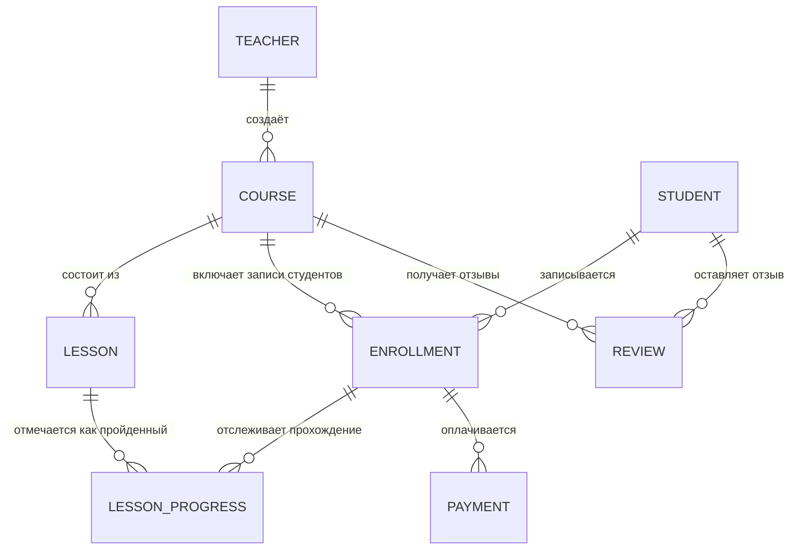
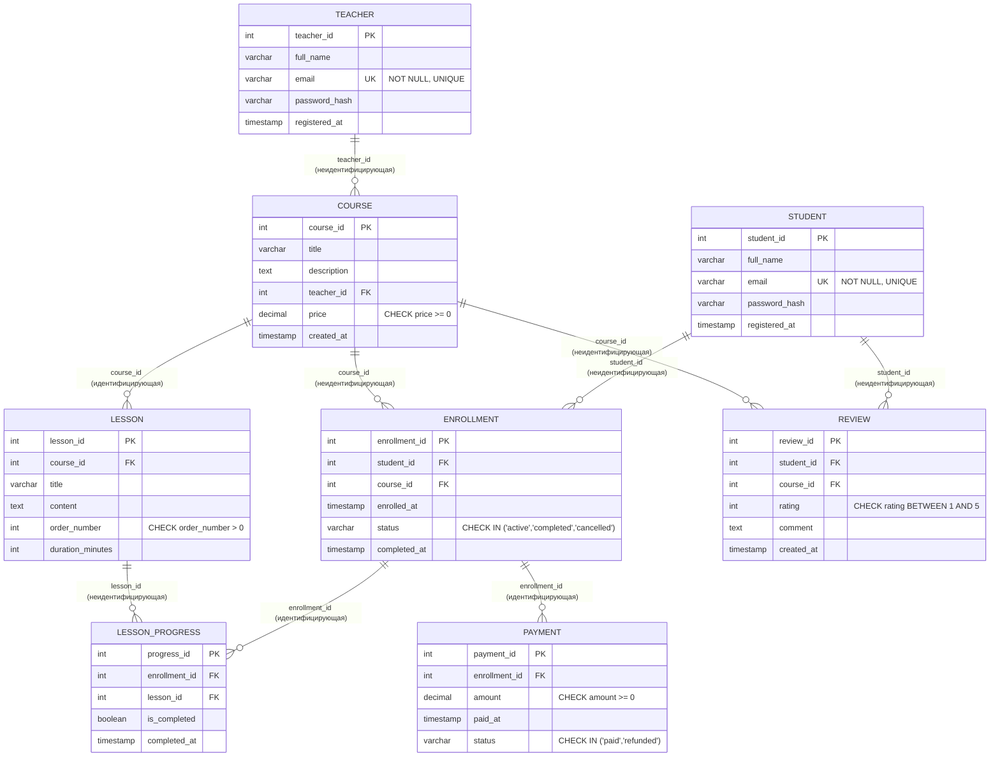

# Домашнее задание №1. От бизнес-требований к физической модели

**Вариант №1. Онлайн-курсы (EdTech)**

ФИО: Якупов Ислям Ринатович
Группа: ДЭ 16-25
Репозиторий: https://github.com/Applsin/databases_2026

> Версия после ревью. Что поменялось и почему — см. раздел «Что исправлено после
> code review» в конце файла.

---

## 0. Бизнес-домен (напоминание условия)

Платформа онлайн-образования. Пользователи регистрируются, выбирают курсы и учатся.
Курс состоит из уроков. Преподаватели создают курсы и получают отчисления от продаж.
Студенты пишут отзывы и ставят оценку курсу от 1 до 5.

Ключевые бизнес-требования, которые определили модель:

1. **Teacher и Student — это разные сущности, а не один "User" с полем role.**
   Первая версия хранила всех в одной таблице `User` с ролью, но в ревью
   правильно заметили: у преподавателя и студента разная "мощность" отношений
   с курсом (только преподаватель создаёт курсы и уроки, только студент платит
   и записывается), и если писать связь `USER ||--o{ COURSE`, то формально
   она как будто относится ко всем пользователям, хотя на самом деле — только
   к части (только к преподавателям). Связь должна быть верна для *всей*
   таблицы целиком, а не для подмножества строк. Поэтому завёл две отдельные
   таблицы: `teacher` и `student`.
2. У курса ровно один автор-преподаватель, но у преподавателя может быть много
   курсов → связь «один ко многим» `Teacher → Course`.
3. Студент может учиться на нескольких курсах, курс может иметь много студентов
   → связь «многие ко многим», реализуемая через ассоциативную сущность
   `Enrollment`.
4. Курс состоит из нескольких уроков, у урока есть порядок показа → `Lesson`
   с полем `order_number` и обязательной привязкой к курсу.
5. Отзыв пишет конкретный студент на конкретный курс, оценка ограничена
   диапазоном 1–5 → `CHECK (rating BETWEEN 1 AND 5)`, и один студент может
   оставить только один отзыв на курс → `UNIQUE (student_id, course_id)`.
6. Нужно хранить статус завершения урока/курса → сущность `LessonProgress`,
   привязанная к `Enrollment` и к `Lesson`.
7. **Платежи нужно хранить отдельно, а не только цену в Course.** В первой
   версии не было ответа на вопрос "где хранятся оплаты за период" — цена
   лежала только в `Course.price`, а реальных фактов оплаты не было вообще.
   Добавил сущность `Payment`: каждая запись — это один факт оплаты
   (сумма и дата), привязанный к конкретной записи на курс (`Enrollment`).
   Так можно: а) считать отчисления преподавателю за произвольный период по
   реальным оплатам, а не по текущей цене курса; б) хранить возвраты
   (`status = 'refunded'`), если студент вернул деньги за курс; в) не терять
   историю, даже если `Course.price` потом изменится — сумма оплаты
   зафиксирована на момент покупки.

---

## 1. Концептуальная модель (без атрибутов)

Сущности (8): **Teacher, Student, Course, Lesson, Enrollment, LessonProgress,
Review, Payment**.



Теперь каждая связь верна для таблицы целиком: `TEACHER ||--o{ COURSE`
означает, что *любой* преподаватель может создать курс — и это действительно
так для всей сущности `Teacher`, а не только для части пользователей.

---

## 2. Логическая модель (с атрибутами, ключами и кардинальностью)

Нотация связей — «воронья лапка» (Crow's Foot):
`||` — «ровно один», `o{` — «ноль или много», `|{` — «один или много».



**Идентифицирующие vs неидентифицирующие связи:**

| Связь | Тип | Почему |
|---|---|---|
| Course → Lesson | идентифицирующая | Урок не имеет смысла без курса |
| Enrollment → LessonProgress | идентифицирующая | Прогресс существует только в контексте записи на курс |
| Enrollment → Payment | идентифицирующая | Оплата всегда привязана к конкретной записи на курс, вне её не имеет смысла |
| Teacher → Course | неидентифицирующая | Курс — самостоятельная сущность, ссылается на автора |
| Student → Enrollment, Course → Enrollment | неидентифицирующая (вместе образуют M:N) | Enrollment зависит от двух родителей |
| Student → Review, Course → Review | неидентифицирующая | Отзыв — независимый факт, ссылается на студента и курс |
| Lesson → LessonProgress | неидентифицирующая | Прогресс уже идентифицируется через Enrollment |

**Ключи:**
- Первичные ключи — суррогатные (`SERIAL`).
- Внешние ключи: `Course.teacher_id → Teacher.teacher_id`,
  `Lesson.course_id → Course.course_id`,
  `Enrollment.student_id → Student.student_id`,
  `Enrollment.course_id → Course.course_id`,
  `LessonProgress.enrollment_id → Enrollment.enrollment_id`,
  `LessonProgress.lesson_id → Lesson.lesson_id`,
  `Review.student_id → Student.student_id`,
  `Review.course_id → Course.course_id`,
  `Payment.enrollment_id → Enrollment.enrollment_id`.
- Составные уникальные ограничения: `Enrollment (student_id, course_id)`,
  `Review (student_id, course_id)`, `LessonProgress (enrollment_id, lesson_id)`.

---

## 3. Физическая модель

SQL-скрипт — в файле [`schema.sql`](./schema.sql), воспроизводимый
(`DROP TABLE IF EXISTS ... CASCADE`).

```bash
psql -h localhost -U postgres -d courses_db -f schema.sql
```

---

## 4. Частые запросы (описание, без SQL)

1. «Вывести список всех курсов с количеством записавшихся студентов».
2. «Найти 10 самых популярных курсов по количеству отзывов и средней оценке».
3. «Показать все уроки конкретного курса в правильном порядке».
4. «Получить историю обучения студента: какие курсы он прошёл, на каком этапе,
   какие оценки поставил».
5. «Рассчитать сумму, которую должен получить преподаватель за месяц» —
   теперь считается суммой `Payment.amount` со `status = 'paid'` по всем
   `Enrollment`, связанным с курсами этого преподавателя, за нужный период
   (по `Payment.paid_at`), а не по `Course.price` — так учитываются и
   возвраты, и изменение цены курса со временем.

---

## Что исправлено после code review

- **Разделил `User` на `Teacher` и `Student`.** Причина: у них разная
  мощность связей с курсом (создаёт / записывается), и связь, написанная
  для одной общей таблицы, была неверна для части строк.
- **Добавил сущность `Payment`.** Причина: не было ответа на вопрос "где
  хранятся оплаты за период" — раньше был только `Course.price`, без
  истории фактических платежей.
- Поправил все ссылки в `Enrollment`, `Review` — теперь они ссылаются на
  `student_id`, а не на общий `user_id`.

---

## Структура репозитория

```
.
├── README.md   — этот файл (концептуальная + логическая модели, обоснования, запросы)
└── schema.sql  — физическая модель: CREATE TABLE для PostgreSQL
```
